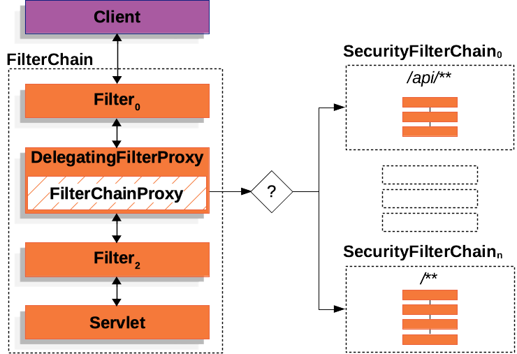

> https://docs.spring.io/spring-security/reference/servlet/architecture.html

===========================================================================
# Architecture
* -> **`Spring Security's high-level architecture`** within **Servlet based applications**
* => the **Authentication**, **Authorization**, and **Protection Against Exploits** is built base on this understanding

* -> **Spring Security’s Servlet support** is based on **`Servlet Filters`**

===========================================================================
# A Review of Filters



* -> khi **Client** gửi request đến **application**, nó sẽ đi qua **`FilterChain`** 
* -> **FilterChain** sẽ bao gồm các **`'Filter' instance`** và **`Servlet`**
* -> Spring hỗ trợ 1 _Filter đặc biệt của Spring_ là **`DelegatingFilterProxy`** - nó giúp đăng ký 1 **Filter tiêu chuẩn của Servlet** nhưng có khả năng **delegate to a Spring Bean implement 'Filter'**
* -> **`FilterChainProxy`** là 1 **`Filter` cung cấp bởi `Spring Security`** dưới dạng **`Bean` nên sẽ được wrapped trong `DelegatingFilterProxy`** để cung cấp 1 starting point cho **Spring Security’s Servlet support**
* -> 1 **FilterChainProxy** sẽ quyết định when/which **`SercurityChain`** / **`Security Filter`** sẽ được invoked cho current request
* -> mỗi **`SercurityChain`** có thể là unique và độc lập lẫn nhau
* -> các **`Security Filters`** in **SecurityFilterChain** are typically **`Beans`** có thể được dùng để **authentication**, **authorization**, **exploit protection**, ...

===========================================================================
# Example

```java - Ex: "FilterChain" Usage
public void doFilter(ServletRequest request, ServletResponse response, FilterChain chain) {
	// do something before the rest of the application
    chain.doFilter(request, response); // invoke the rest of the application
    // do something after the rest of the application
}
```

```java - Ex: "DelegatingFilterProxy" Pseudo Code
public void doFilter(ServletRequest request, ServletResponse response, FilterChain chain) {
	Filter delegate = getFilterBean(someBeanName); 
	delegate.doFilter(request, response); 
}
```

```java - Ex: security configuration
@Configuration
@EnableWebSecurity
public class SecurityConfig {

    @Bean
    public SecurityFilterChain filterChain(HttpSecurity http) throws Exception {
        http
            .csrf(Customizer.withDefaults()) // result in "CsrfFilter"
            .authorizeHttpRequests(authorize -> authorize // result in "AuthorizationFilter"
                .anyRequest().authenticated()
            ) 
            .httpBasic(Customizer.withDefaults()) // result in "BasicAuthenticationFilter"
            .formLogin(Customizer.withDefaults()); // result in "UsernamePasswordAuthenticationFilter"
        return http.build();
    }
}

// Thứ tự thực thi là:
// -> first, the CsrfFilter is invoked to protect against CSRF attacks
// -> second, the authentication filters are invoked to authenticate the request
// -> third, the AuthorizationFilter is invoked to authorize the request
```

===========================================================================
# Adding a Custom Filter to the Filter Chain
* -> **``most of the time, the default security filters are enough`** to provide security to your application
* -> _however, there might be times that we want to add a custom Filter to the security filter chain_

* -> we can also use **`HttpSecurity#addFilterAfter`** / **`HttpSecurity#addFilterBefore`** to add the filter **after/before a particular filter** 
* -> or **`HttpSecurity#addFilterAt`** to add the filter **at a particular filter position** in the filter chain

## Example
* assumpt we want to add a **`Filter`** that **gets a tenant id header** and **check if the current user has access to that tenant**
* -> the previous description already gives us a clue on where to add the filter, 
* -> since we need to know the current user, we need to add it after the authentication filters

```java
public class TenantFilter implements Filter {

    @Override
    public void doFilter(ServletRequest servletRequest, ServletResponse servletResponse, FilterChain filterChain) throws IOException, ServletException {
        HttpServletRequest request = (HttpServletRequest) servletRequest;
        HttpServletResponse response = (HttpServletResponse) servletResponse;

        // Get the tenant id from the request header:
        String tenantId = request.getHeader("X-Tenant-Id"); 

        // 	Check if the current user has access to the tenant id
        boolean hasAccess = isUserAllowed(tenantId); 

        if (hasAccess) {
            // invoke the rest of the filters in the chain
            filterChain.doFilter(request, response); 
            return;
        }
        
        // if the user does not have access
        throw new AccessDeniedException("Access denied"); 
    }
}
```

```java -  add the filter to the security filter chain
@Bean
SecurityFilterChain filterChain(HttpSecurity http) throws Exception {
    http
        // ...

        // use 'addFilterBefore' to add the TenantFilter before the AuthorizationFilter
        // -> make sure TenantFilter is invoked after the authentication filters
        // -> 
        .addFilterBefore(new TenantFilter(), AuthorizationFilter.class); 
    return http.build();
}
```

## OncePerRequestFilter
* -> instead of implementing **Filter**, we can extend from **`OncePerRequestFilter`**
* -> which is **a base class for filters** that are **`only invoked once per request`** and provides a **`doFilterInternal`** method with the "HttpServletRequest" and "HttpServletResponse" parameters

## Note: declare filter as a Spring bean
* -> either by annotating it with **@Component** or by declaring it as **a bean in our configuration**, because **Spring Boot will `automatically register it with the embedded container`**
* => that may **`cause the filter to be invoked twice`**, once by the container and once by Spring Security and in a different order

* -> if we still want to **`declare our filter as a Spring bean`** to take advantage of dependency injection
* => to avoid the duplicate invocation, we can **tell Spring Boot to not register it with the container** by declaring a **`FilterRegistrationBean`** bean and setting its "enabled" property to "false":

```java
@Bean
public FilterRegistrationBean<TenantFilter> tenantFilterRegistration(TenantFilter filter) {
    FilterRegistrationBean<TenantFilter> registration = new FilterRegistrationBean<>(filter);
    registration.setEnabled(false);
    return registration;
}
```

===========================================================================
# Handling Security Exceptions
* -> "ExceptionTranslationFilter" is inserted into the **FilterChainProxy** as one of the **`Security Filters`**

* -> the **ExceptionTranslationFilter** allows **translation of `AccessDeniedException` and `AuthenticationException` into HTTP responses**
* => if the application does not throw an AccessDeniedException or an AuthenticationException, then **`ExceptionTranslationFilter does not do anything`**

## Process
* -> first, the **ExceptionTranslationFilter** invokes **FilterChain.doFilter(request, response)** to **`invoke the rest of the application`** (_nói chung là tiếp tục processing request như bình thường_)

* -> if the **`user is not authenticated`** or it is an **`AuthenticationException`**, then **Start Authentication**
* -> the **`SecurityContextHolder` is cleared out**
* -> the **`HttpServletRequest` is saved** so that it can be used to replay the original request once authentication is successful
* -> the **`AuthenticationEntryPoint` is used to request credentials from the client** (_For example, it might redirect to a "/login page" or send a "WWW-Authenticate header"_)

* -> otherwise, if it is an **`AccessDeniedException`**, then **Access Denied**;
* -> the **`AccessDeniedHandler` is invoked** to handle access denied

```java - pseudocode for "ExceptionTranslationFilter"
try 
{
	filterChain.doFilter(request, response); 
    // means that if another part of the application (FilterSecurityInterceptor or method security) 
    // throws an AuthenticationException or AccessDeniedException 
    // it is caught and also handled here
} 
catch (AccessDeniedException | AuthenticationException ex) 
{
	if (!authenticated || ex instanceof AuthenticationException) {
		startAuthentication(); 
	} else {
		accessDenied(); 
	}
}
```

===========================================================================
# Saving Requests Between Authentication
* _as illustrated in **Handling Security Exceptions**, when a request has no authentication and is for a resource that requires authentication_, 
* -> there is a need to **save the request for the authenticated resource** to **`re-request after authentication is successful`**
* -> in "Spring Security" this is done by **saving the HttpServletRequest** using a **`RequestCache`** implementation

## RequestCache

## RequestCacheAwareFilter

===========================================================================
# Printing the Security Filters
* -> it's useful to see the list of security Filters that are invoked for a particular request
* -> https://docs.spring.io/spring-security/reference/servlet/architecture.html#servlet-logging

# Logging
